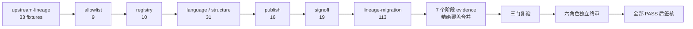

# WP5 剩余任务看板

> 更新：2026-07-24（America/Denver）  
> 当前活动版本：`20260724T034858702Z-b530a67793c84b6e9d71f53c8d0b0a98`  
> 当前 manifest：`9dc55bce45eb0dd499fcfd2fe3cbca6fd2319f5ab99c619ca98c04129998d3b1`

| 状态 | 工作项 | 已完成 / 总数 | 当前事实与下一动作 |
|---|---|---:|---|
| ✅ 完成 | 全量证据回归 | 231 / 231 | 七阶段完整 evidence 已完成；本次理论文字更新后已发布并重新绑定新活动版本。 |
| ✅ 完成 | 版本与根绑定 | 4 / 4 | 新 manifest、成员根、根文件与签核记录一致。 |
| ✅ 完成 | 最终验证门 | 3 / 3 | `SemanticOnly`、`SkipSignoff` 与默认门均 PASS。 |
| ✅ 完成 | 六角色独立终审 | 6 / 6 | 六个 AI 专项审查角色均 PASS，正式签核记录已落档。 |

## 不变量

- 04/05 SHA-256 必须保持冻结值。
- 16+1 范围不扩大；附录 6--10、12 不进入 WP5 签核集合。
- evidence 仅引用已发布版本，不写回同轮 manifest；partial 不得代替完整阶段 evidence。
- 默认门的唯一允许拒绝为 `independent signoff Pending`。

## 回环31完成状态（2026-07-23）

- ✅ 7/7 全阶段完整证据已通过并绑定活动清单 `3e57a5a2…d7a077c8`：upstream 33、allowlist 9、registry 10、language 31、publish 16、signoff 19、lineage 113（合计231）。
- ✅ 三门复验：`SemanticOnly`、`SkipSignoff` PASS；默认门仅因 `independent signoff Pending` 拒绝。
- ⏳ 六角色独立终审仍 Pending；未代签、未改签核状态。
